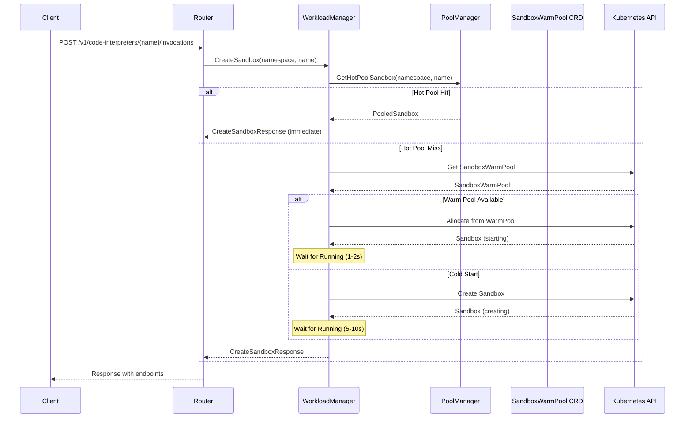
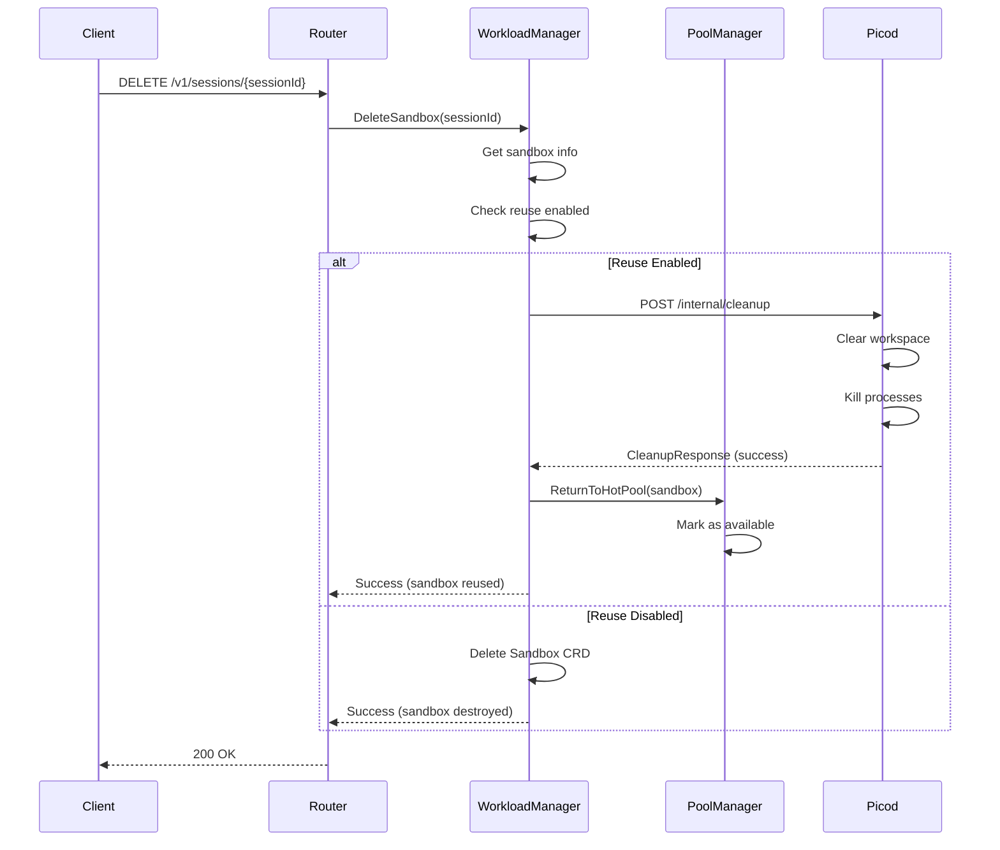

# Enhanced Warm Pool Design

## Summary

This proposal introduces three enhancements to AgentCube's warm pool implementation to reduce cold-start latency and improve resource efficiency:

1. **Multi-Level Warm Pool**: A hierarchical pool structure (Hot/Warm/Cold) that provides different levels of readiness for sandbox allocation.
2. **Dynamic Pool Sizing**: Automatic adjustment of pool sizes based on historical traffic patterns and prediction algorithms.
3. **Sandbox Reuse Strategy**: Reusing sandboxes across sessions by cleaning internal state instead of destroying and recreating.

These enhancements work together to provide sub-second sandbox allocation for latency-sensitive workloads while optimizing resource utilization.

## Motivation

### Background

AgentCube currently uses a single-level warm pool mechanism provided by the [agent-sandbox](https://github.com/kubernetes-sigs/agent-sandbox) project. While this reduces cold-start latency compared to on-demand creation, several limitations exist:

1. **Static Pool Size**: The `WarmPoolSize` parameter is statically configured in `CodeInterpreter` CRD. Operators must manually adjust this value based on expected traffic, leading to either:
   - Under-provisioning: Increased cold-start latency during traffic spikes
   - Over-provisioning: Wasted resources during low-traffic periods

2. **Single-Level Pool**: All pre-warmed sandboxes have the same readiness state. There's no distinction between:
   - Sandboxes that are fully running and ready to serve immediately (zero latency)
   - Sandboxes that have images pulled but need startup time (1-2 second latency)

3. **No Sandbox Reuse**: When a session ends, the sandbox is destroyed. For high-churn workloads (e.g., code interpreters in notebooks), this causes:
   - Repeated cold-start latency for each new session
   - Increased load on container runtime from frequent create/destroy cycles
   - Warming-up overhead (JIT compilation, cache population) repeated for each session

### Goals

1. **Reduce P99 Latency**: Achieve sub-100ms sandbox allocation for the 99th percentile of requests through hot pool hits.
2. **Dynamic Resource Allocation**: Automatically scale pool sizes based on traffic patterns, reducing manual intervention.
3. **Improve Resource Efficiency**: Reuse sandboxes where possible to minimize container lifecycle overhead.
4. **Maintain Backward Compatibility**: Existing `CodeInterpreter` and `AgentRuntime` CRDs should continue to work without modification.
5. **Provide Observability**: Expose metrics for pool utilization, hit rates, and prediction accuracy.

### Non-Goals

1. **Machine Learning-Based Prediction**: Initial implementation uses simple statistical methods. ML-based prediction can be added later as a pluggable component.
2. **Cross-Namespace Pool Sharing**: Sandboxes are not shared across namespaces for security isolation.
3. **GPU Resource Pooling**: This proposal focuses on CPU/memory resources. GPU pooling is deferred to future work.
4. **State Migration**: Migrating state between sandboxes (e.g., for scaling) is out of scope.
5. **Changing agent-sandbox CRDs**: This proposal builds on existing `SandboxWarmPool` CRD without modification.

### User Stories

#### Story 1: Low-Latency Code Interpreter

As an AI application developer using AgentCube's code interpreter, I want sandboxes to be available within 100ms when I execute code, so that my users experience responsive interactive sessions without noticeable delays.

**Current Experience**: 
- First request: 5-10 seconds (cold start)
- Subsequent requests: 1-2 seconds (warm pool)

**Expected Experience with Hot Pool**:
- First request: < 100ms (hot pool hit)
- Hot pool miss: 1-2 seconds (warm pool)
- Warm pool miss: 5-10 seconds (cold start)

#### Story 2: Cost-Optimized Resource Usage

As a platform operator managing multiple AgentCube deployments, I want the warm pool to automatically scale down during off-peak hours (e.g., nighttime) and scale up before peak hours (e.g., morning), so that I can minimize infrastructure costs while maintaining acceptable latency.

**Current Experience**:
- Must over-provision for peak traffic
- Resources wasted during low-traffic periods
- Manual intervention required to adjust pool sizes

**Expected Experience with Dynamic Sizing**:
- Pool automatically scales from 5 to 50 based on traffic
- No manual intervention required
- 40-60% cost reduction during off-peak hours

#### Story 3: High-Frequency Session Workload

As a data scientist using Jupyter notebooks backed by AgentCube code interpreters, I frequently start and stop sessions as I work through different analyses. I want session startup to be fast and consistent, so that my workflow is not interrupted by waiting for sandboxes to initialize.

**Current Experience**:
- Each new session: 1-2 seconds (warm pool allocation)
- Cumulative delay: Significant over many sessions

**Expected Experience with Sandbox Reuse**:
- Reused sessions: < 50ms (hot pool, already initialized)
- Clean sessions: 1-2 seconds (warm pool)
- Consistent performance across session churn

---

## Proposal

### Design Overview

```
                                    ┌─────────────────────────────────────────┐
                                    │            Traffic Predictor            │
                                    │  ┌─────────────────────────────────┐    │
                                    │  │ Historical Traffic Analysis     │    │
                                    │  │ - Base load calculation         │    │
                                    │  │ - Time-of-day patterns          │    │
                                    │  │ - Trend detection               │    │
                                    │  └─────────────────────────────────┘    │
                                    └──────────────────┬──────────────────────┘
                                                       │ Predicted Demand
                                                       ▼
┌──────────────────────────────────────────────────────────────────────────────────┐
│                              Pool Manager                                         │
│  ┌─────────────────────────────────────────────────────────────────────────────┐ │
│  │                          Allocation Flow                                     │ │
│  │  Request ──► Hot Pool? ──► Warm Pool? ──► Create New                        │ │
│  │              (0ms)       (1-2s)       (5-10s)                                │ │
│  └─────────────────────────────────────────────────────────────────────────────┘ │
│                                                                                   │
│  ┌───────────────────┐  ┌───────────────────┐  ┌───────────────────────────┐    │
│  │    Hot Pool       │  │    Warm Pool      │  │      Cold Pool            │    │
│  │ (Memory Managed)  │  │ (CRD Managed)     │  │   (On-Demand)             │    │
│  │                   │  │                   │  │                           │    │
│  │ • Fully started   │  │ • Image pulled    │  │ • No pre-allocation       │    │
│  │ • Ready to serve  │  │ • Fast startup    │  │ • Create on first request │    │
│  │ • 3-5 instances   │  │ • 10-20 instances │  │ • Infinite capacity       │    │
│  └───────────────────┘  └───────────────────┘  └───────────────────────────┘    │
│           ▲                      ▲                       ▲                       │
│           │                      │                       │                       │
│           └──────────────────────┴───────────────────────┘                       │
│                        Pool Autoscaler (CRD Updates)                              │
└──────────────────────────────────────────────────────────────────────────────────┘
                                                       │
                                                       ▼
┌──────────────────────────────────────────────────────────────────────────────────┐
│                         Sandbox Reuse Manager                                     │
│  ┌─────────────────────────────────────────────────────────────────────────────┐ │
│  │                     Session End Flow                                         │ │
│  │  Session End ──► Cleanup State ──► Return to Hot Pool ──► Ready for Reuse   │ │
│  │                  (30s timeout)                                                │ │
│  └─────────────────────────────────────────────────────────────────────────────┘ │
│                                                                                   │
│  Cleanup Operations:                                                              │
│  • Clear /workspace directory                                                     │
│  • Kill user processes (SIGTERM then SIGKILL)                                    │
│  • Reset environment variables                                                    │
│  • Clear network state (optional)                                                │
└──────────────────────────────────────────────────────────────────────────────────┘
```

### Component Details

#### 1. Multi-Level Warm Pool

##### 1.1 Pool Hierarchy

| Pool Level | State | Allocation Latency | Management | Typical Size |
|------------|-------|-------------------|------------|--------------|
| **Hot Pool** | Fully started, ready | < 100ms | In-memory (PoolManager) | 3-5 |
| **Warm Pool** | Image pulled, paused | 1-2s | SandboxWarmPool CRD | 10-20 |
| **Cold Pool** | Config only | 5-10s | On-demand creation | ∞ |

##### 1.2 Pool Allocation Algorithm

```
func allocateSandbox(namespace, name, kind) -> Sandbox:
    // 1. Try Hot Pool (memory-managed, fastest)
    if sandbox := hotPool.Get(namespace, name, kind); sandbox != nil:
        return sandbox  // ~0ms latency
    
    // 2. Try Warm Pool (CRD-managed, fast)
    if sandbox := warmPool.Get(namespace, name, kind); sandbox != nil:
        return sandbox  // ~1-2s latency
    
    // 3. Cold Pool (on-demand, slowest)
    return createNewSandbox(namespace, name, kind)  // ~5-10s latency
```

##### 1.3 Pool Transition Rules

| From | To | Trigger | Action |
|------|-----|---------|--------|
| Cold | Warm | Pre-warm command | Create SandboxWarmPool CRD |
| Warm | Hot | High traffic prediction | Start sandbox, add to hot pool |
| Hot | In Use | Session allocation | Mark as allocated |
| In Use | Hot | Session end + cleanup | Return to hot pool |
| Hot | Warm | Idle timeout | Stop sandbox, keep in warm pool |
| Warm | Cold | Low traffic + scale down | Delete SandboxWarmPool CRD |

##### 1.4 Hot Pool Configuration

The hot pool is configured via the `CodeInterpreter` CRD:

```yaml
apiVersion: runtime.agentcube.volcano.sh/v1alpha1
kind: CodeInterpreter
metadata:
  name: my-interpreter
spec:
  # ... existing fields ...
  
  # Hot Pool Configuration (new)
  hotPool:
    # Enable hot pool (default: false for backward compatibility)
    enabled: true
    
    # Minimum number of hot sandboxes to maintain
    # These are always ready, consuming resources
    minSize: 3
    
    # Maximum number of hot sandboxes
    # Prevents unbounded resource consumption
    maxSize: 10
    
    # Idle timeout before returning to warm pool
    # Hot sandboxes unused for this duration are demoted
    idleTimeout: 5m
    
    # Session reuse configuration
    reuse:
      enabled: true
      # Maximum number of times a sandbox can be reused
      # Prevents resource leaks from accumulating
      maxReuseCount: 100
      # Timeout for cleanup operation
      cleanupTimeout: 30s
```

#### 2. Dynamic Pool Sizing

##### 2.1 Traffic Prediction Algorithm

The traffic predictor uses a simple statistical model combining three components:

```
Predicted(t) = BaseLoad(t) + PeriodicPattern(t) + Trend(t)

Where:
- BaseLoad: Exponential moving average of session count over last N hours
- PeriodicPattern: Time-of-day adjustment based on same-hour historical data
- Trend: Linear regression on recent data points
```

**Implementation Details**:

```go
type TrafficPredictor struct {
    config PredictorConfig
    history []TrafficSample  // Circular buffer of historical samples
    historyMu sync.RWMutex
}

type PredictorConfig struct {
    // History window for base load calculation
    HistoryWindow time.Duration  // Default: 2 hours
    
    // Minimum samples before prediction is valid
    MinSamples int  // Default: 10
    
    // Safety margin multiplier (predicted * margin)
    SafetyMargin float64  // Default: 1.2
    
    // Prediction window (how far ahead to predict)
    PredictionWindow time.Duration  // Default: 30 minutes
}

type TrafficSample struct {
    Timestamp time.Time
    SessionCount int64    // Active sessions
    RequestCount int64    // Total requests
}

type PredictionResult struct {
    PredictedSessions int64     // Predicted session demand
    RecommendedSize int32       // Recommended pool size
    Confidence float64          // 0.0 - 1.0
    PredictedAt time.Time
}
```

##### 2.2 Prediction Confidence

Confidence is calculated based on:
- **Sample count**: More historical data → higher confidence
- **Variance**: Lower variance in historical data → higher confidence
- **Recency**: More recent samples weighted higher

```
Confidence = 0.3 * SampleScore + 0.4 * StabilityScore + 0.3 * RecencyScore
```

Actions are only taken when confidence exceeds threshold (default: 0.5).

##### 2.3 Pool Autoscaler

The autoscaler periodically evaluates predictions and adjusts pool sizes:

```go
type PoolAutoscalerConfig struct {
    Enabled bool
    
    // How often to evaluate and adjust
    CheckInterval time.Duration  // Default: 5 minutes
    
    // Pool size bounds
    MinSize int32
    MaxSize int32
    
    // Scale adjustment step (prevent large jumps)
    ScaleStep int32  // Default: 5
    
    // Cooldown periods
    ScaleUpCooldown time.Duration   // Default: 5 minutes
    ScaleDownCooldown time.Duration // Default: 15 minutes
}
```

**Scaling Logic**:

```
func reconcile(target):
    prediction := predictor.Predict()
    
    if prediction.Confidence < 0.5:
        return  // Don't scale with low confidence
    
    currentSize := getCurrentPoolSize(target)
    desiredSize := prediction.RecommendedSize
    
    if desiredSize > currentSize:
        if !canScaleUp(target):  // Check cooldown
            return
        newSize := min(currentSize + scaleStep, desiredSize, maxSize)
        scaleUp(target, newSize)
        recordScaleUp(target)
    
    else if desiredSize < currentSize:
        if !canScaleDown(target):  // Check cooldown
            return
        newSize := max(currentSize - scaleStep, desiredSize, minSize)
        scaleDown(target, newSize)
        recordScaleDown(target)
```

##### 2.4 Traffic Collection

Traffic data is collected at the Router layer:

```go
// In Router's request handler
func (r *Router) handleRequest(req *Request) {
    // Record traffic sample
    r.trafficCollector.Record(TrafficSample{
        Timestamp: time.Now(),
        Namespace: req.Namespace,
        Name: req.Name,
        Kind: req.Kind,
    })
    
    // Continue with request processing
    // ...
}
```

Samples are aggregated and persisted to Redis with TTL (default: 24 hours).

#### 3. Sandbox Reuse Strategy

##### 3.1 Session Lifecycle with Reuse

```
┌─────────────────────────────────────────────────────────────────────┐
│                    Session Lifecycle (with Reuse)                   │
├─────────────────────────────────────────────────────────────────────┤
│                                                                     │
│  1. Session Start                                                   │
│     ┌──────────────┐                                                │
│     │   Request    │                                                │
│     └──────┬───────┘                                                │
│            │                                                        │
│            ▼                                                        │
│     ┌──────────────┐     ┌──────────────┐                          │
│     │  Hot Pool    │ Yes │   Return     │                          │
│     │  Available?  ├────►│  Existing    │                          │
│     └──────┬───────┘     └──────────────┘                          │
│            │ No                                                    │
│            ▼                                                        │
│     ┌──────────────┐                                                │
│     │Allocate from │                                                │
│     │ Warm/Cold    │                                                │
│     └──────────────┘                                                │
│                                                                     │
│  2. Session Active                                                  │
│     ┌──────────────┐                                                │
│     │   Process    │                                                │
│     │   Requests   │                                                │
│     └──────────────┘                                                │
│                                                                     │
│  3. Session End                                                     │
│     ┌──────────────┐                                                │
│     │   Session    │                                                │
│     │   Complete   │                                                │
│     └──────┬───────┘                                                │
│            │                                                        │
│            ▼                                                        │
│     ┌──────────────┐     ┌──────────────┐     ┌──────────────┐     │
│     │  Reuse       │ Yes │    State     │ Yes │   Return     │     │
│     │  Enabled?    ├────►│   Cleanup    ├────►│  to Hot Pool │     │
│     └──────┬───────┘     └──────────────┘     └──────────────┘     │
│            │ No                    │ Fail                          │
│            │                       ▼                                │
│            └──────────────────►┌──────────────┐                    │
│                                │   Destroy    │                    │
│                                │   Sandbox    │                    │
│                                └──────────────┘                    │
│                                                                     │
└─────────────────────────────────────────────────────────────────────┘
```

##### 3.2 State Cleanup Protocol

Picod exposes a cleanup endpoint for state sanitization:

```go
// POST /internal/cleanup
// Authorization: Bearer <jwt-token>
// Content-Type: application/json

type CleanupRequest struct {
    // Clear all files in /workspace
    ClearWorkspace bool `json:"clearWorkspace"`
    
    // Terminate all user-spawned processes
    KillProcesses bool `json:"killProcesses"`
    
    // Reset environment to defaults
    ResetEnv bool `json:"resetEnv"`
    
    // Clear iptables rules (optional, may require capabilities)
    ClearNetwork bool `json:"clearNetwork"`
}

type CleanupResponse struct {
    Success bool `json:"success"`
    Message string `json:"message"`
    Duration time.Duration `json:"duration"`
    
    // Detailed results
    FilesCleared int `json:"filesCleared"`
    ProcessesKilled int `json:"processesKilled"`
    Errors []string `json:"errors,omitempty"`
}
```

##### 3.3 Cleanup Implementation Details

**Process Termination**:
1. Enumerate all processes via `/proc` filesystem
2. Identify user processes (exclude picod, pause, system processes)
3. Send `SIGTERM` to each process
4. Wait 100ms for graceful shutdown
5. Send `SIGKILL` to remaining processes

**Workspace Cleanup**:
1. List all entries in `/workspace`
2. Delete each entry with `os.RemoveAll`
3. Report count of deleted items

**Timeout Handling**:
- Maximum cleanup duration: 30 seconds
- If timeout exceeded, cleanup fails and sandbox is destroyed

##### 3.4 Security Considerations

| Concern | Mitigation |
|---------|------------|
| State leakage between sessions | Complete workspace wipe + process kill |
| Resource exhaustion during cleanup | 30-second timeout, resource limits |
| Malicious cleanup endpoint | JWT authentication required |
| Privilege escalation | Cleanup runs as picod user, no elevated privileges |
| Data remanence | Workspace uses tmpfs (memory-backed) where possible |

##### 3.5 Reuse Limits

To prevent resource leaks and degradation:

```yaml
reuse:
  # Maximum reuse count before mandatory destruction
  # Prevents accumulation of subtle state leaks
  maxReuseCount: 100
  
  # Maximum time a sandbox can remain in hot pool
  # Ensures periodic refresh
  maxAge: 24h
```

---

## API Changes

### CodeInterpreter CRD Extensions

```go
// Add to CodeInterpreterSpec
type CodeInterpreterSpec struct {
    // ... existing fields ...
    
    // HotPool configures the hot pool for this code interpreter.
    // +optional
    HotPool *HotPoolConfig `json:"hotPool,omitempty"`
}

type HotPoolConfig struct {
    // Enabled enables the hot pool for this runtime.
    // +kubebuilder:default=false
    Enabled bool `json:"enabled"`
    
    // MinSize is the minimum number of hot sandboxes to maintain.
    // +kubebuilder:default=3
    // +kubebuilder:validation:Minimum=0
    MinSize int32 `json:"minSize,omitempty"`
    
    // MaxSize is the maximum number of hot sandboxes.
    // +kubebuilder:default=10
    // +kubebuilder:validation:Minimum=1
    MaxSize int32 `json:"maxSize,omitempty"`
    
    // IdleTimeout is the duration after which an idle hot sandbox
    // is returned to the warm pool.
    // +kubebuilder:default="5m"
    IdleTimeout *metav1.Duration `json:"idleTimeout,omitempty"`
    
    // Reuse configures sandbox reuse behavior.
    // +optional
    Reuse *ReuseConfig `json:"reuse,omitempty"`
    
    // DynamicSizing configures automatic pool size adjustment.
    // +optional
    DynamicSizing *DynamicSizingConfig `json:"dynamicSizing,omitempty"`
}

type ReuseConfig struct {
    // Enabled enables sandbox reuse.
    // +kubebuilder:default=true
    Enabled bool `json:"enabled"`
    
    // MaxReuseCount is the maximum times a sandbox can be reused.
    // +kubebuilder:default=100
    MaxReuseCount int32 `json:"maxReuseCount,omitempty"`
    
    // CleanupTimeout is the maximum duration for state cleanup.
    // +kubebuilder:default="30s"
    CleanupTimeout *metav1.Duration `json:"cleanupTimeout,omitempty"`
}

type DynamicSizingConfig struct {
    // Enabled enables dynamic pool sizing.
    // +kubebuilder:default=false
    Enabled bool `json:"enabled"`
    
    // MinSize is the minimum pool size (warm + hot).
    // +kubebuilder:default=5
    MinSize int32 `json:"minSize,omitempty"`
    
    // MaxSize is the maximum pool size.
    // +kubebuilder:default=50
    MaxSize int32 `json:"maxSize,omitempty"`
    
    // PredictionWindow is how far ahead to predict traffic.
    // +kubebuilder:default="30m"
    PredictionWindow *metav1.Duration `json:"predictionWindow,omitempty"`
    
    // ScaleUpCooldown is the minimum time between scale-up operations.
    // +kubebuilder:default="5m"
    ScaleUpCooldown *metav1.Duration `json:"scaleUpCooldown,omitempty"`
    
    // ScaleDownCooldown is the minimum time between scale-down operations.
    // +kubebuilder:default="15m"
    ScaleDownCooldown *metav1.Duration `json:"scaleDownCooldown,omitempty"`
    
    // SafetyMargin is the multiplier applied to predicted size.
    // +kubebuilder:default=1.2
    SafetyMargin float64 `json:"safetyMargin,omitempty"`
}
```

---

## Implementation Details

### New Components

| Component | Location | Description |
|-----------|----------|-------------|
| `PoolManager` | `pkg/workloadmanager/pool_manager.go` | Manages hot pool in memory |
| `TrafficPredictor` | `pkg/workloadmanager/traffic_predictor.go` | Predicts traffic demand |
| `PoolAutoscaler` | `pkg/workloadmanager/pool_autoscaler.go` | Adjusts pool sizes via CRD updates |
| `CleanupHandler` | `pkg/picod/cleanup.go` | State cleanup endpoint |

### Modified Components

| Component | Changes |
|-----------|---------|
| `Server` | Initialize PoolManager, integrate with sandbox allocation |
| `handleSandboxCreate` | Check hot pool before warm/cold allocation |
| `handleDeleteSandbox` | Optionally return to hot pool instead of destroy |
| `CodeInterpreter` CRD | Add hot pool configuration fields |

### Sequence Diagrams

#### Sandbox Allocation Flow



#### Session End with Reuse



---

## Metrics and Observability

### New Metrics

```
# Hot Pool Metrics
agentcube_hot_pool_size{namespace, name}                    # Current hot pool size
agentcube_hot_pool_available{namespace, name}               # Available sandboxes
agentcube_hot_pool_allocated{namespace, name}               # Allocated sandboxes
agentcube_hot_pool_hit_total{namespace, name}               # Successful hot pool hits
agentcube_hot_pool_miss_total{namespace, name}              # Hot pool misses

# Warm Pool Metrics (existing, included for completeness)
agentcube_warm_pool_size{namespace, name}                   # Current warm pool size

# Reuse Metrics
agentcube_sandbox_reuse_total{namespace, name}              # Total reuse operations
agentcube_sandbox_reuse_success_total{namespace, name}      # Successful reuses
agentcube_sandbox_reuse_failed_total{namespace, name}       # Failed reuses
agentcube_sandbox_cleanup_duration_seconds{namespace, name} # Cleanup duration histogram

# Prediction Metrics
agentcube_prediction_sessions{namespace, name}              # Predicted session count
agentcube_prediction_confidence{namespace, name}            # Prediction confidence
agentcube_prediction_pool_size{namespace, name}             # Recommended pool size

# Autoscaler Metrics
agentcube_autoscaler_scale_up_total{namespace, name}        # Scale-up operations
agentcube_autoscaler_scale_down_total{namespace, name}      # Scale-down operations
agentcube_autoscaler_cooldown_active{namespace, name}       # Cooldown status
```

### Grafana Dashboard

A new dashboard should include:
1. **Pool Utilization Panel**: Hot/Warm pool sizes over time
2. **Latency Breakdown**: P50/P99 allocation latency by source (hot/warm/cold)
3. **Reuse Rate**: Percentage of sessions served by reused sandboxes
4. **Prediction Accuracy**: Predicted vs actual demand

---

## Configuration Examples

### Minimal Configuration (Reuse Only)

```yaml
apiVersion: runtime.agentcube.volcano.sh/v1alpha1
kind: CodeInterpreter
metadata:
  name: minimal-interpreter
spec:
  template:
    image: agentcube/code-interpreter:latest
    resources:
      requests:
        cpu: "500m"
        memory: "512Mi"
  
  # Enable reuse with defaults
  hotPool:
    enabled: true
    reuse:
      enabled: true
```

### Standard Configuration (Hot Pool + Reuse)

```yaml
apiVersion: runtime.agentcube.volcano.sh/v1alpha1
kind: CodeInterpreter
metadata:
  name: standard-interpreter
spec:
  template:
    image: agentcube/code-interpreter:latest
    resources:
      requests:
        cpu: "1"
        memory: "1Gi"
  
  sessionTimeout: 15m
  maxSessionDuration: 8h
  
  hotPool:
    enabled: true
    minSize: 3
    maxSize: 10
    idleTimeout: 5m
    reuse:
      enabled: true
      maxReuseCount: 100
      cleanupTimeout: 30s
```

### Full Configuration (All Features)

```yaml
apiVersion: runtime.agentcube.volcano.sh/v1alpha1
kind: CodeInterpreter
metadata:
  name: full-featured-interpreter
spec:
  template:
    image: agentcube/code-interpreter:latest
    resources:
      requests:
        cpu: "2"
        memory: "2Gi"
      limits:
        cpu: "4"
        memory: "4Gi"
  
  sessionTimeout: 15m
  maxSessionDuration: 8h
  warmPoolSize: 20
  
  hotPool:
    enabled: true
    minSize: 5
    maxSize: 15
    idleTimeout: 10m
    
    reuse:
      enabled: true
      maxReuseCount: 200
      cleanupTimeout: 45s
    
    dynamicSizing:
      enabled: true
      minSize: 10
      maxSize: 100
      predictionWindow: 30m
      scaleUpCooldown: 5m
      scaleDownCooldown: 15m
      safetyMargin: 1.3
```

---

## Testing Strategy

### Unit Tests

| Component | Test Cases |
|-----------|------------|
| `PoolManager` | - Get from empty pool<br>- Get from pool with match<br>- Get from pool without match<br>- Return to pool<br>- Max reuse count enforcement<br>- Eviction logic |
| `TrafficPredictor` | - Prediction with insufficient samples<br>- Prediction with valid history<br>- Confidence calculation<br>- Cooldown enforcement |
| `PoolAutoscaler` | - Scale up decision<br>- Scale down decision<br>- Cooldown respect<br>- CRD update |

### Integration Tests

1. **Hot Pool Flow**: Create sandbox → return to pool → reuse → verify new SessionID
2. **Warm Pool Fallback**: Exhaust hot pool → verify warm pool allocation
3. **Cold Start Fallback**: Exhaust both pools → verify new sandbox creation
4. **Cleanup Flow**: End session → cleanup → verify workspace cleared
5. **Dynamic Sizing**: Simulate traffic pattern → verify pool adjustment

### E2E Tests

1. **Latency Verification**: Measure P99 allocation latency with hot pool enabled
2. **Scale Test**: High churn workload → verify no degradation
3. **Long-Running**: 24-hour soak test → verify no memory leaks

---

## Rollout Plan

### Phase 1: Sandbox Reuse (Week 1-2)

**Goal**: Enable sandbox reuse without hot pool

**Changes**:
- Add `/internal/cleanup` endpoint to Picod
- Modify `handleDeleteSandbox` to support reuse
- Add `reuse` configuration to CodeInterpreter CRD

**Rollout**:
- Feature flag controlled (default: disabled)
- Enable for single test namespace
- Monitor for state leakage issues

### Phase 2: Hot Pool (Week 3-4)

**Goal**: Implement in-memory hot pool

**Changes**:
- Implement `PoolManager`
- Modify `handleSandboxCreate` to check hot pool
- Add `hotPool` configuration to CodeInterpreter CRD

**Rollout**:
- Feature flag controlled (default: disabled)
- Gradual enablement across namespaces
- Monitor pool hit rates

### Phase 3: Dynamic Sizing (Week 5-6)

**Goal**: Automatic pool size adjustment

**Changes**:
- Implement `TrafficPredictor`
- Implement `PoolAutoscaler`
- Add `dynamicSizing` configuration

**Rollout**:
- Feature flag controlled (default: disabled)
- Start with conservative bounds
- Monitor prediction accuracy

---

## Risks and Mitigations

| Risk | Impact | Mitigation |
|------|--------|------------|
| **State leakage between sessions** | Security vulnerability | Comprehensive cleanup + max reuse count + periodic rotation |
| **Memory leak in hot pool** | Resource exhaustion | Max pool size + idle timeout + monitoring |
| **Prediction inaccuracy** | Under/over-provisioning | Conservative safety margin + manual override |
| **Cleanup timeout** | Poor user experience | 30s timeout + fallback to destroy |
| **Hot pool unavailable after restart** | Temporary latency increase | Warm pool fallback + fast recovery |
| **Complexity increase** | Maintenance burden | Feature flags + comprehensive tests + documentation |

---

## Alternatives Considered

### Alternative 1: Separate HotPool CRD

Instead of managing hot pool in memory, create a dedicated `SandboxHotPool` CRD.

**Pros**:
- Persistent across restarts
- Kubernetes-native management
- Visible in kubectl

**Cons**:
- Higher latency (CRD operations)
- More complex reconciliation
- Resource overhead

**Decision**: Rejected for initial implementation. May reconsider if persistence becomes critical.

### Alternative 2: ML-Based Prediction

Use machine learning for traffic prediction instead of statistical methods.

**Pros**:
- Potentially higher accuracy
- Can capture complex patterns

**Cons**:
- Requires significant training data
- Higher computational cost
- More complex to debug

**Decision**: Deferred to future work. Statistical methods provide reasonable accuracy with lower complexity.

### Alternative 3: Connection Pooling at Router

Implement pooling at the Router layer instead of Workload Manager.

**Pros**:
- Centralized management
- Simpler workload manager

**Cons**:
- Router becomes stateful
- Difficult HA setup
- Doesn't leverage existing warm pool

**Decision**: Rejected. Workload Manager is the appropriate layer for pool management.

---

## Future Work

1. **ML-Based Prediction**: Integrate with ML models for improved accuracy
2. **Cross-Region Pooling**: Share pools across clusters/regions
3. **Predictive Pre-warming**: Start sandboxes before predicted demand
4. **GPU Pooling**: Extend to GPU resources
5. **State Checkpointing**: Save/restore sandbox state for faster recovery

---

## References

- [Agent-Sandbox Warm Pool](https://github.com/kubernetes-sigs/agent-sandbox/blob/main/docs/warm-pool.md)
- [AgentCube Architecture](./architecture/overview.md)
- [PicoD Authentication Design](./PicoD-Plain-Authentication-Design.md)
- [Runtime Template Proposal](./runtime-template-proposal.md)
